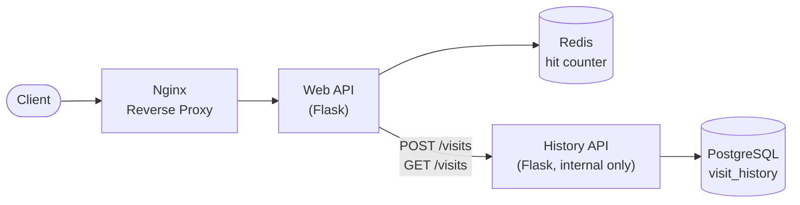

# Scalable Microservices Stack


[](https://github.com/Furkan5E/scalable-microservices-stack/actions/workflows/test.yaml)

A containerised microservices architecture demonstrating service decomposition, inter-service communication, caching, persistent data storage, and strict dependency management.

## Architecture

The application is composed of two independently deployable Flask services plus supporting infrastructure:

| Service | Technology | Purpose |
|---|---|---|
| **Web API** | Flask | Public-facing gateway. Handles requests, tracks visit counts in Redis, and calls the History API over HTTP |
| **History API** | Flask | Internal service. Owns PostgreSQL exclusively; records and serves visit history on behalf of the Web API |
| **Reverse Proxy** | Nginx | Receives incoming traffic and forwards requests to the Web API |
| **Cache** | Redis | Stores frequently accessed data in memory to reduce database load |
| **Database** | PostgreSQL | Provides persistent relational data storage, accessed only by the History API |

The Web API never touches Postgres directly, it calls the History API's internal REST endpoints (`POST /visits`, `GET /visits`). This is the actual service boundary in the stack: two services with their own codebases, dependencies, containers, and failure modes, communicating over the network rather than sharing a database.



## Key Features
*   **Containerised:** Fully isolated services deployed using Docker Compose or Kubernetes.
*   **Deterministic Builds:** Exact dependencies locked via `pyproject.toml` and `uv.lock`.
*   **Resilient Initialisation:** Custom health checks ensure the API waits for the database to be fully ready before booting.
*   **Automated Testing:** Comprehensive Pytest suite utilising mocked database connections.

## Installation

**1. Clone the repository and install dependencies**
```bash
git clone https://github.com/Furkan5E/scalable-microservices-stack.git
cd scalable-microservices-stack
uv sync
```
**2. Create a .env file in the root directory and add your secure credentials:**
```
POSTGRES_USER=postgres
POSTGRES_PASSWORD=your_secure_password
```
**3. Launch the Cluster**

Build and start all services in the background:
```bash
docker compose up --build -d
```
Check the running containers:
```bash
docker compose ps
```
To stop the application
```bash
docker compose down
```
## Deploy with Kubernetes
Copy the secrets template and set your own credentials (`k8s/secrets.yaml` is gitignored, so real credentials never get committed):
```bash
cp k8s/secrets.yaml.example k8s/secrets.yaml
# edit k8s/secrets.yaml with your own POSTGRES_PASSWORD
```
Apply the infrastructure manifests to local cluster
```bash
kubectl apply -f k8s/secrets.yaml
kubectl apply -f k8s/nginx-config.yaml
kubectl apply -f k8s/postgres.yaml
kubectl apply -f k8s/redis.yaml
kubectl apply -f k8s/history.yaml
kubectl apply -f k8s/history-networkpolicy.yaml
kubectl apply -f k8s/web.yaml
kubectl apply -f k8s/nginx.yaml
```
If you are using a local kind cluster, open a tunnel to the reverse proxy.
```bash
kubectl port-forward service/nginx 8080:8080
```
## API Endpoints

### Web API (public, via Nginx)
`GET /` - Root endpoint. Tracks your visit count in Redis and reports the visit to the History API for persistence.

`GET /health` - System diagnostic endpoint ensuring the Web API is responsive.

`GET /history` - Proxies the History API and returns the last 10 recorded visits.

### History API (internal only)
`GET /health` - System diagnostic endpoint ensuring the History API is responsive.

`POST /visits` - Records a single visit `{"hostname": ..., "timestamp": ...}` in PostgreSQL.

`GET /visits` - Returns the last 10 visits stored in PostgreSQL.

## Testing
To run the automated test suite locally using uv:
```bash
uv run pytest
```
