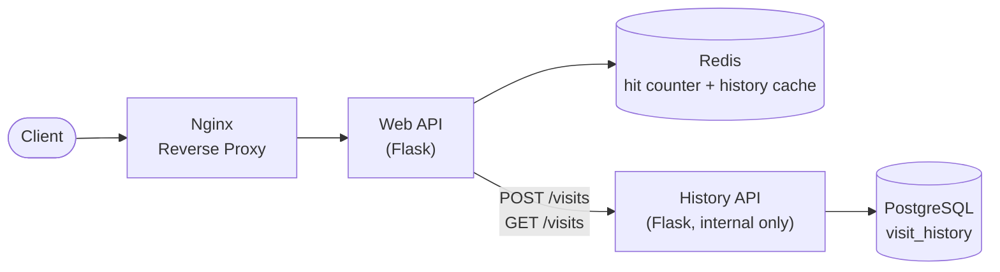

# Scalable Microservices Stack


[](https://github.com/Furkan5E/scalable-microservices-stack/actions/workflows/test.yaml)
[](https://github.com/Furkan5E/scalable-microservices-stack/actions/workflows/e2e.yaml)

A containerised microservices stack that runs on Docker Compose or Kubernetes, where it autoscales, enforces its service boundary with NetworkPolicies, and keeps serving when a dependency goes down. It demonstrates service decomposition, inter-service communication, caching, persistent data storage, and strict dependency management.

## Architecture

The application is composed of two independently deployable Flask services plus supporting infrastructure:

| Service | Technology | Purpose |
|---|---|---|
| **Web API** | Flask | Public-facing gateway. Handles requests, tracks visit counts in Redis, caches history reads, and calls the History API over HTTP |
| **History API** | Flask | Internal service. Owns PostgreSQL exclusively; records and serves visit history on behalf of the Web API |
| **Reverse Proxy** | Nginx | Receives incoming traffic and forwards requests to the Web API |
| **Cache** | Redis | Holds the hit counter and caches the `/history` response for 30 seconds to reduce load on the History API and database |
| **Database** | PostgreSQL | Provides persistent relational data storage, accessed only by the History API |

The Web API never touches Postgres directly. Instead it calls the History API's internal REST endpoints (`POST /visits`, `GET /visits`). This is the actual service boundary in the stack: two services with their own codebases, dependencies, containers, and failure modes, communicating over the network rather than sharing a database. On Kubernetes the boundary is enforced by NetworkPolicies: only web pods can reach the History API, and only History pods can reach Postgres.


```mermaid
flowchart LR
    Client(["Client"]) --> Nginx["Nginx\nReverse Proxy"]
    Nginx --> Web["Web API\n(Flask)"]
    Web --> Redis[("Redis\nhit counter + history cache")]
    Web -- "POST /visits\nGET /visits" --> History["History API\n(Flask, internal only)"]
    History --> Postgres[("PostgreSQL\nvisit_history")]
```

## Key Features
*   **Containerised:** Fully isolated services deployed using Docker Compose or Kubernetes.
*   **Horizontally Scalable:** The stateless Web API runs as 3 replicas on Kubernetes and autoscales to 6 under CPU load.
*   **Deterministic Builds:** Exact dependencies locked via `pyproject.toml` and `uv.lock`.
*   **Resilient Initialisation:** Custom health checks ensure the API waits for the database to be fully ready before booting.
*   **Read Caching:** `/history` is served from Redis using a cache-aside pattern with a 30 second TTL, invalidated whenever a new visit is recorded.
*   **Graceful Degradation:** The Web API keeps responding when Redis or the History API is down, with fail-fast timeouts so an outage never hangs a request.
*   **Enforced Service Boundary:** Kubernetes NetworkPolicies allow only web pods to reach the History API, and only History pods to reach Postgres.
*   **Automated Testing:** Pytest suite covering both services with mocked Redis, HTTP and database calls.
*   **End-to-End CI:** Every push deploys the stack to a throwaway kind cluster and checks scaling, caching, persistence and the NetworkPolicy.
*   **Linting:** Ruff runs alongside the test suite in GitHub Actions.

## Prerequisites
*   [Docker](https://docs.docker.com/get-docker/) with Docker Compose, to run the stack locally.
*   [kubectl](https://kubernetes.io/docs/tasks/tools/) and a Kubernetes cluster (Docker Desktop, kind or similar), for the Kubernetes deployment.
*   [uv](https://docs.astral.sh/uv/), only needed to run the tests and linter.

## Run with Docker Compose

**1. Clone the repository**
```bash
git clone https://github.com/Furkan5E/scalable-microservices-stack.git
cd scalable-microservices-stack
```
**2. Create a .env file from the template and set your own password:**
```bash
cp .env.example .env
# edit .env with your own POSTGRES_PASSWORD
```
**3. Launch the stack**

Build and start all services in the background:
```bash
docker compose up --build -d
```
Check the running containers:
```bash
docker compose ps
```
The API is then available through Nginx at `http://localhost:8080`:
```bash
curl localhost:8080/
curl localhost:8080/history
```
To stop the application
```bash
docker compose down
```
## Deploy with Kubernetes
The manifests pull the Web API and History API images from GitHub Container Registry (`ghcr.io/furkan5e/scalable-microservices-web` and `ghcr.io/furkan5e/scalable-microservices-history`), which the Build Docker workflow publishes on every push to `master`. The images are public, so no local build or registry login is needed.

Copy the secrets template and set your own credentials (`k8s/secrets.yaml` is gitignored, so real credentials never get committed):
```bash
cp k8s/secrets.yaml.example k8s/secrets.yaml
# edit k8s/secrets.yaml with your own POSTGRES_PASSWORD
```
Apply the infrastructure manifests to local cluster
```bash
kubectl apply -f k8s/secrets.yaml
kubectl apply -f k8s/nginx-config.yaml
kubectl apply -f k8s/postgres.yaml
kubectl apply -f k8s/postgres-networkpolicy.yaml
kubectl apply -f k8s/redis.yaml
kubectl apply -f k8s/history.yaml
kubectl apply -f k8s/history-networkpolicy.yaml
kubectl apply -f k8s/web.yaml
kubectl apply -f k8s/web-hpa.yaml
kubectl apply -f k8s/nginx.yaml
```
On a local cluster, open a tunnel to the reverse proxy:
```bash
kubectl port-forward service/nginx 8080:8080
```
The API is then available at `http://localhost:8080`, with the same endpoints as the Docker Compose setup.
## Scaling
The Web API is stateless (the hit counter lives in Redis), so it scales horizontally. A HorizontalPodAutoscaler keeps a minimum of 3 web replicas and scales up to 6 when average CPU passes 70% of the request.

Each response reports the pod that served it, so repeated requests show the load being spread while the Redis counter stays shared:
```bash
for i in 1 2 3; do curl -s localhost:8080/; echo; done
```
```
{"db_status":"Recorded in Postgres","hostname":"web-5876c6c846-wj7q9","message":"Hello from the Scaled Full Stack!","redis_visits":7}
{"db_status":"Recorded in Postgres","hostname":"web-5876c6c846-785p5","message":"Hello from the Scaled Full Stack!","redis_visits":8}
{"db_status":"Recorded in Postgres","hostname":"web-5876c6c846-gqlfc","message":"Hello from the Scaled Full Stack!","redis_visits":9}
```
Scaling beyond the minimum needs the Kubernetes [metrics-server](https://github.com/kubernetes-sigs/metrics-server), which local clusters often do not ship with. Without it the stack still runs at 3 replicas. To watch the autoscaler react, generate load from inside the cluster:
```bash
kubectl run load --image=busybox:1.36 --restart=Never -- sh -c 'for j in 1 2 3 4 5 6 7 8; do (while true; do wget -q -O /dev/null http://web:5000/health; done) & done; sleep 150'
kubectl get hpa web --watch
kubectl delete pod load
```

## API Endpoints

### Web API (public, via Nginx)
`GET /` - Root endpoint. Tracks your visit count in Redis and reports the visit to the History API for persistence. Still responds if either dependency is down: `redis_visits` is `null` when Redis is unreachable, and `db_status` reports when the History API is unavailable.

`GET /health` - System diagnostic endpoint ensuring the Web API is responsive.

`GET /history` - Returns the last 10 recorded visits, from the Redis cache when available and the History API otherwise. The `X-Cache` response header reports `HIT` or `MISS`.

### History API (internal only)
`GET /health` - System diagnostic endpoint ensuring the History API is responsive.

`POST /visits` - Records a single visit `{"hostname": ..., "timestamp": ...}` in PostgreSQL.

`GET /visits` - Returns the last 10 visits stored in PostgreSQL.

## Design Decisions
*   **The History API owns Postgres.** Database failures and schema changes stay inside one service. When it is down, the Web API still answers and reports the problem in `db_status` instead of failing.
*   **The cache is invalidated on write, with a TTL as a backstop.** A new visit shows up in `/history` straight away. The trade-off is that the cache only pays off when history is read more often than visits are recorded.
*   **The Redis client fails fast.** It uses 1 second timeouts and no retries, because a counter and a cache are not worth holding a request open for.
*   **The web Deployment sets no replica count.** The HorizontalPodAutoscaler owns it, so re-applying the manifest never fights the autoscaler.
*   **Postgres uses the `Recreate` strategy.** Its volume can only be mounted by one pod at a time, so the old pod has to stop before the new one starts.

## Testing
Install the dependencies and run the automated test suite locally using uv:
```bash
uv sync
uv run pytest
```
To lint the codebase:
```bash
uv run ruff check .
```
### End-to-end
The End to End workflow builds both images from the commit, deploys the manifests to a throwaway [kind](https://kind.sigs.k8s.io/) cluster and runs `scripts/e2e.sh` against it. The script checks that the stack comes up with 3 web replicas, that a visit reaches Redis and Postgres, that `/history` goes from a cache miss to a cache hit, and that Postgres is unreachable from outside the History API.

To run the same checks against a cluster you have already deployed to:
```bash
bash scripts/e2e.sh
```
